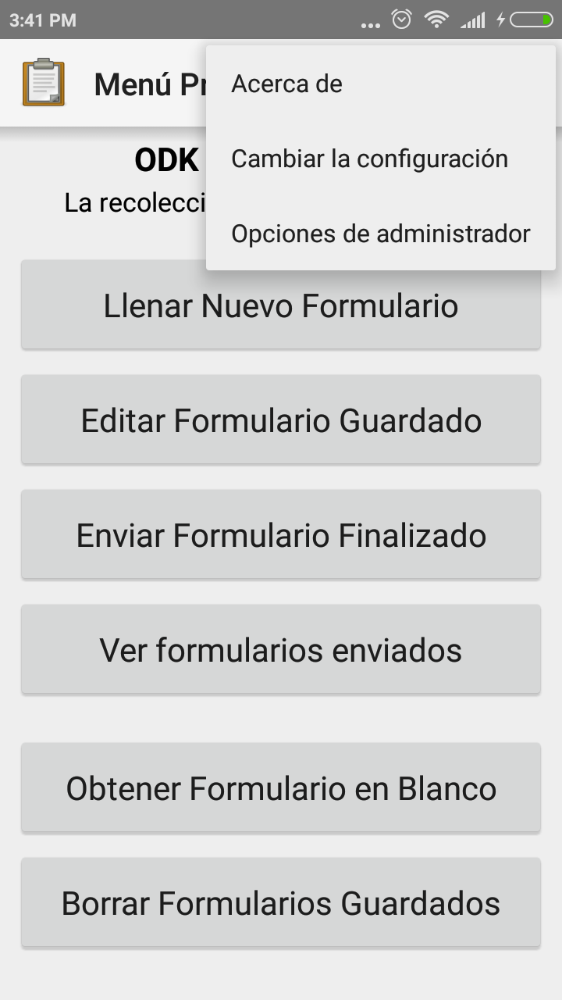
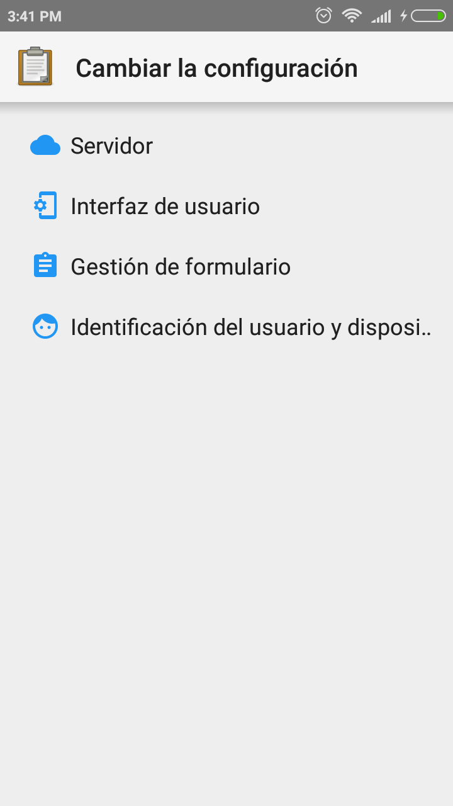
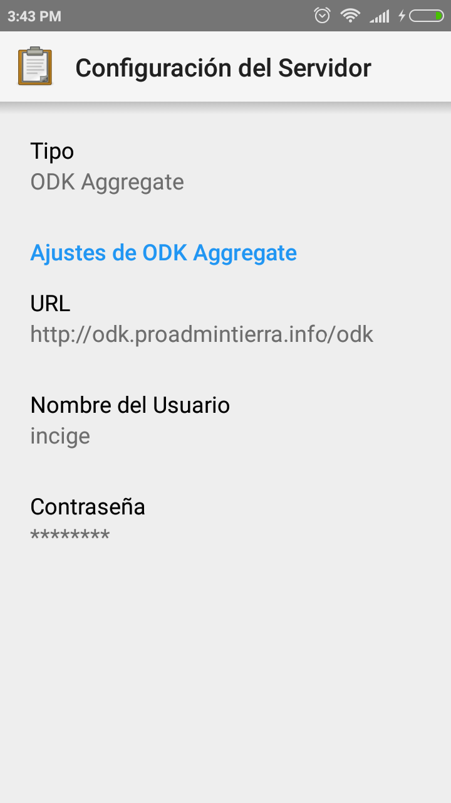
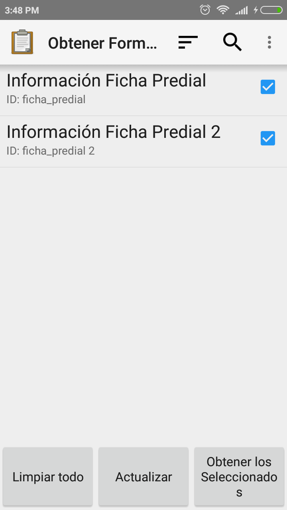

# ¿Cómo realizar el llenado del formulario?

## Instala Odk-Collet
Este puede obtener de https://play.google.com/store/apps/details?id=org.odk.collect.android

## Abrir la app y configurar
Entra a cambiar la configuración, modifica los datos del servidor y actualiza la lista de formulario a obtener.

## Comienza a llenar
Luego inicia un nuevo formulario y recopila la información qué te indique

Así de sencillo tendrás el formulario de predio para el LADM_COL
